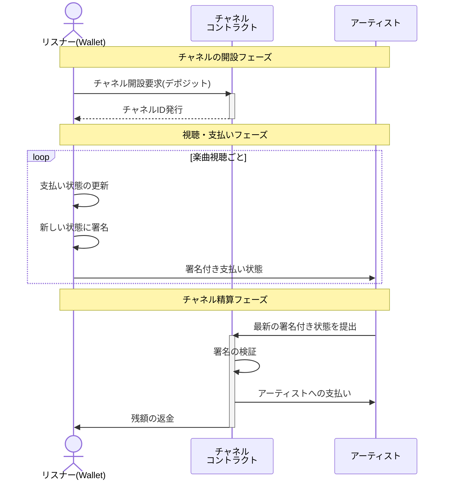

# PaymentChannelの実装

## プロジェクトの目的
ストリーミングサービスやMetamask等の連携  
最終的にはペイメントチャネルを使った視聴履歴の集積を目的とする

基本的なペイメントチャネルの流れは以下を想定


## コントラクトの作成

```solidity
// SPDX-License-Identifier: MIT
pragma solidity ^0.8.17;

import "@openzeppelin/contracts/security/ReentrancyGuard.sol";
import "@openzeppelin/contracts/utils/cryptography/ECDSA.sol";

contract ModernChannel is ReentrancyGuard {
    using ECDSA for bytes32;

    address public immutable sender;
    address public immutable recipient;
    uint256 public immutable startTime;
    uint256 public immutable timeout;

    event ChannelClosed(uint256 amount);
    event DisputeRaised(bytes32 messageHash);

    constructor(address _recipient, uint256 _timeout) payable {
        sender = msg.sender;
        recipient = _recipient;
        startTime = block.timestamp;
        timeout = _timeout;
    }

    function closeChannel(
        uint256 amount,
        bytes memory signature
    ) external nonReentrant {
        bytes32 messageHash = keccak256(
            abi.encodePacked(address(this), amount)
        ).toEthSignedMessageHash();
        
        require(
            messageHash.recover(signature) == sender,
            "Invalid signature"
        );

        require(
            amount <= address(this).balance,
            "Insufficient balance"
        );

        emit ChannelClosed(amount);
        
        (bool success, ) = payable(recipient).call{value: amount}("");
        require(success, "Transfer failed");
        
        selfdestruct(payable(sender));
    }
}
```

## セキュリティ面について
- OpenZeppelinのReentrancyGuardを使用して再入攻撃を防止

- ECDSAライブラリ（楕円曲線デジタル署名アルゴリズム）を使用して署名の検証を実装

```solidity
contract ModernChannel is ReentrancyGuard {
    using ECDSA for bytes32;
```



